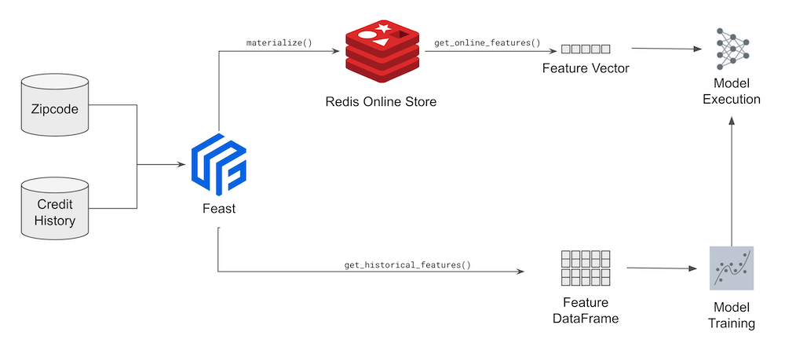
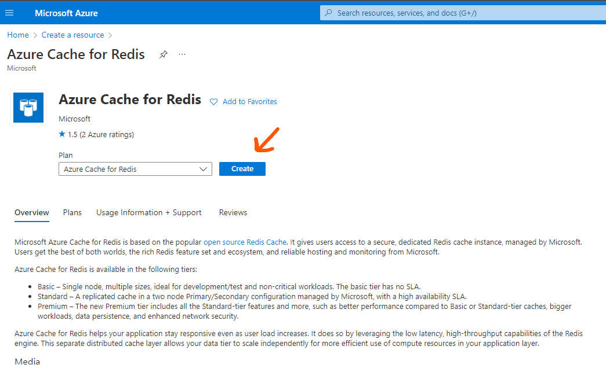
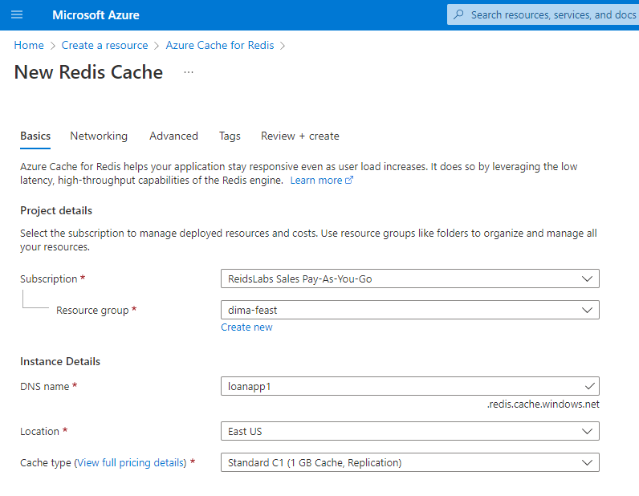
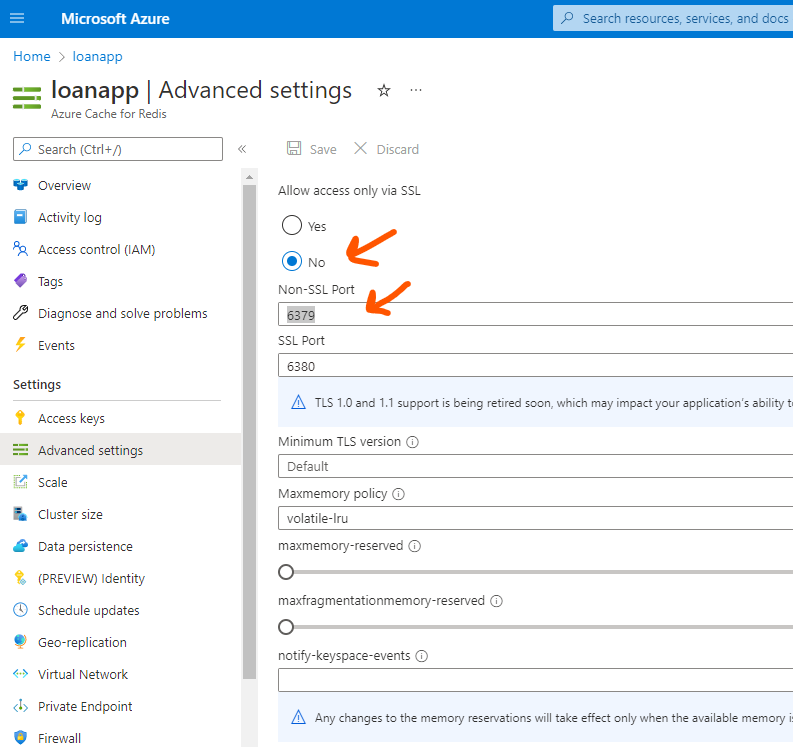
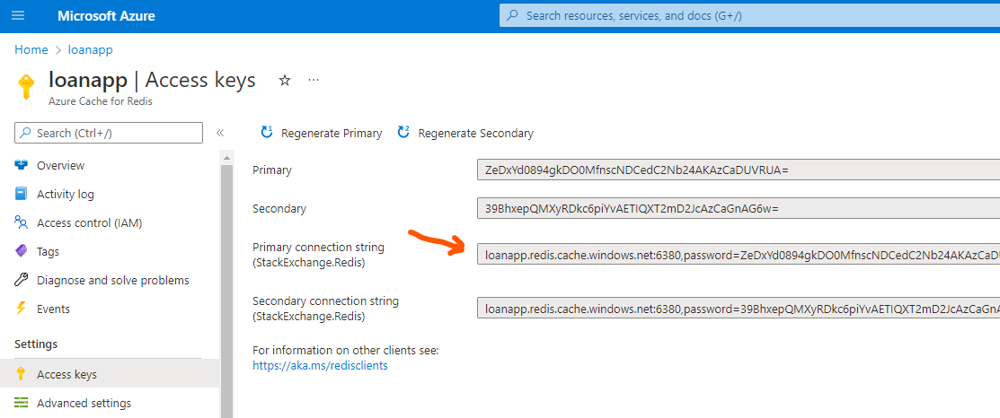
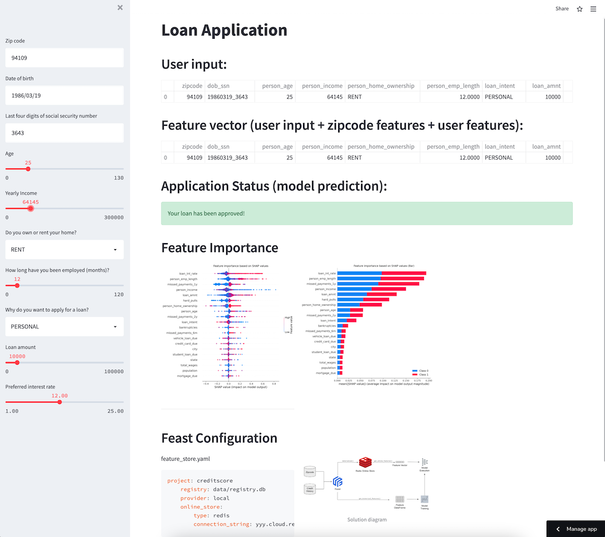

# Real-time Loan Approval demo

This application is the adopted [Feast Credit Scoring Tutorial](https://github.com/feast-dev/feast-aws-credit-scoring-tutorial) to use Redis as __online__ feature store and local files as __offline__ store.


Feast supports Redis and so this demo can be configured to use local Redis instance, Redis Cloud or ACRE.

## Preparing Redis

Jump to one of the sections below depending on how you want to use Redis for the demo:

- [Using ACRE](#using-acre)
- [Using Redis Cloud](#using-redis-cloud)
- [Using local Redis](#using-local-redis)

### Using ACRE

1. Go to [Azure portal](portal.azure.com) and provision Azure Cache for Redis:



2. Populate basic properties and hit 'Create' (Standard tier should be fine for demo):



3. Wait until Redis is fully provisioned (may take up to 20 mins), then navigate to the resource.

4. Go to 'Advanced settings' and enable non-SSL port:

>Note: this is for demo purpose only, never do this in production!



5. Go to 'Access keys' and grab the connection string - you will need it later while setting up the app as well as the feature store settings:



6. Modify connection string to adjust the port number:

> loanapp.redis.cache.windows.net:__6379__,password=Ze...A=

Make note of this string as you will be using this later on.

### Using Redis Cloud

Create the new Redis Cloud database using the [trial subscription](https://redis.com/try-free/).

Check the database DNS name:

```
dig +short redis-13125.c238.us-central1-2.gce.cloud.redislabs.com
```

Log in with `redis-cli` command:
```
redis-13125.c238.us-central1-2.gce.cloud.redislabs.com
```

### Using local Redis

Run Redis Stack in a docker container:

```
docker run -d --name redis-stack -p 6379:6379 -p 8001:8001 redis/redis-stack:latest
```

See more details about using this docker container [here](https://hub.docker.com/r/redis/redis-stack)

## Local demo setup

1. Create new virtual environment and activate it:

```
python3.8 -m venv venv

source venv/bin/activate
```

2. Update `pip` and install project dependencies:

```
pip install -U pip wheel

pip install -r requirements.txt
```

3. Edit the [creditscore/feature_store.yml](creditscore/feature_store.yaml) file to uncomment the `connection_string` property and populate it with the redis connection string you captured before:

```
online_store:
    type: redis
    # connection string: <dns-name>:<port>,password=<password>
    # example for Redis Cloud
    # connection_string: redis-13125.c238.us-central1-2.gce.cloud.redislabs.com:<port,password=QMt...wNnB
    # example for Azure
    # connection_string: loanapp.redis.cache.windows.net:6379,password=Ze...A=
    connection_string: localhost:6379
```

4. Initialize feast repository:

```
cd creditscore
feast apply

OR

feast -c creditscore apply
```

5. Materialize features to Redis:

```
CURRENT_TIME=$(date -u +"%Y-%m-%dT%H:%M:%S")
feast -c creditscore materialize-incremental $CURRENT_TIME
```

6. Return to the main directory and train the model:

```
cd ..
python run.py
```

You now have the model ready to be served and the latest features materialized and stored in Redis database. You can try and explore the size of the online store by connecting to redis server using `redis-cli`:

```
❯ redis-cli -h loanapp.redis.cache.windows.net -p 6379 -a Ze...A= dbsize
Warning: Using a password with '-a' or '-u' option on the command line interface may not be safe.
(integer) 57477
```

## Running demo locally

You can run and test the model using either `run.py` (CLI) or `streamlit_app.py` (Browser). [Streamlit](https://streamlit.io/) is the framework that allows building web data apps in minutes.

1. First, you need to configure the connection to Redis for your application by creating a file `.streamlit/secrets.toml` and adding the conection string to there (make sure to replace the connection string value based on the location of your Redis database):

```
mkdir .streamlit

echo "redis_connection_string = \"localhost:6379"" > .streamlit/secrets.toml
```

2. Next, run the application using the command below:

```
streamlit run streamlit_app.py
```

3. In the browser you can play with the loan parameters to see if your loan gets approved or rejected.

> Note: the loan application parameters are joined with the applicant's credit history (feature vector) stored in Redis to make an approval decision! 

## Streamlit hosted demo

Follow the instructions on [Streamlit Cloud](https://streamlit.io/cloud) to deploy a hosted version of this demo.

Also, explore [Redis Cloud](https://app.redislabs.com/#/login) for a free tier of Redis Enterprise on AWS and GCP.


